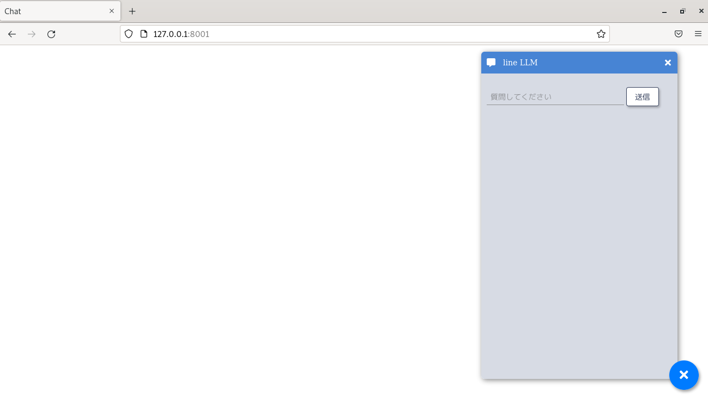

# chatux-server-llm

[](https://github.com/sotokisehiro/chatux-server-llm/actions/workflows/workflow.yml)

ローカル環境で動作する文章生成 AI チャットボットです。

CPU だけで動作するため NVIDIA のグラフィックスボードは不要です。

# 最低要件

- Linux, Windows11, macOS で動作を確認
- 第 8 世代以降の Corei 3
- メインメモリ 8G バイト
- ストレージ 10G バイト
  - SSD を強く推奨

Linux 用の簡易インストーラ/サーバー起動用のスクリプトあり

# インストール手順（Linux 版）

任意のディレクトリで付属の簡易インストーラスクリプトを実行してください。

```
bash ./install_linux.sh
```

# インストール手順（Windows 版）

本サイトからなんらかの方法で環境一式をダウンロードし、任意のフォルダに配置したのち、
PowerShell から次のコマンドを実行してください。

```
python3 -m venv venv
venv/Scripts/activate
pip3 install -r requirements.txt
wget -P models https://huggingface.co/mmnga/ELYZA-japanese-Llama-2-7b-fast-instruct-gguf/resolve/main/ELYZA-japanese-Llama-2-7b-fast-instruct-q4_K_M.gguf

python main.py
```

# 実行時の注意

初回実行時のみ、インターネットから大量のダウンロードが発生するため、しばらくお待ちください。
エラーがなければ AI サーバーが起動しますので、ブラウザから次の URL を開いてください。

```
http://127.0.0.1:8001/
```

次のような画面が表示されれば起動成功です。お楽しみください。



次の画像をクリックすると YouTube で応答速度を確認できます。

[](https://youtu.be/h3-edtm-NLQ)

# TIPS

- メインメモリ不足で言語モデル変換できない方は
  [huggingface](https://huggingface.co/sehiro/LINE-ct2-jp)
  から変換済のモデルをダウンロードしてください。
  - もっともメモリを使う `ct2-transformers-converter` コマンドの実行をスキップできます。

- つよつよ CPU をお持ちの方は次のオプションを追加すると、AI エンジンがより高速に動作する可能性があります。
  - 副作用として若干メインメモリの消費量が増えます。

```
python main.py --aiengine=1 --maxspeed=ON
```

### デフォルトの AI エンジンを llama.cpp に差し替え

AI エンジンを llama.cpp に差し替えることで、主に Llama 系言語モデルの高速化を狙っています。

[huggingface](https://huggingface.co/mmnga/ELYZA-japanese-Llama-2-7b-fast-instruct-gguf)から
モデル([ELYZA-japanese-Llama-2-7b-fast-instruct-q4_K_M.gguf](https://huggingface.co/mmnga/ELYZA-japanese-Llama-2-7b-fast-instruct-gguf/resolve/mainELYZA-japanese-Llama-2-7b-fast-instruct-q4_K_M.gguf))をダウンロードして `models` フォルダに配置したあとに下記の
手順でコマンドプロンプト等から次のコマンドを入力してください。

```
pip install -r requirements.txt
python main.py
```

### Docker で動かす

ビルド環境を整えるのが難しい場合は Docker を使って起動できます。

[huggingface](https://huggingface.co/mmnga/ELYZA-japanese-Llama-2-7b-fast-instruct-gguf)から
モデル([ELYZA-japanese-Llama-2-7b-fast-instruct-q4_K_M.gguf](https://huggingface.co/mmnga/ELYZA-japanese-Llama-2-7b-fast-instruct-gguf/resolve/main/ELYZA-japanese-Llama-2-7b-fast-instruct-q4_K_M.gguf))を
ダウンロードして `models` フォルダに配置したあとに下記の手順で起動および終了してください。

#### 起動

```
docker compose up
```

#### 終了

`Ctrl + C` で `SIG_TERM` を送信して終了します。

#### 停止

`docker compose up` で作成されたコンテナやネットワークの削除を行います。

```
docker compose down
```

## ToDo

- Windows 版インストーラの開発
- 各種パラメータの微調整
- 設定ファイルのサポート
- LoRA のサポート

# ライセンス

MIT

